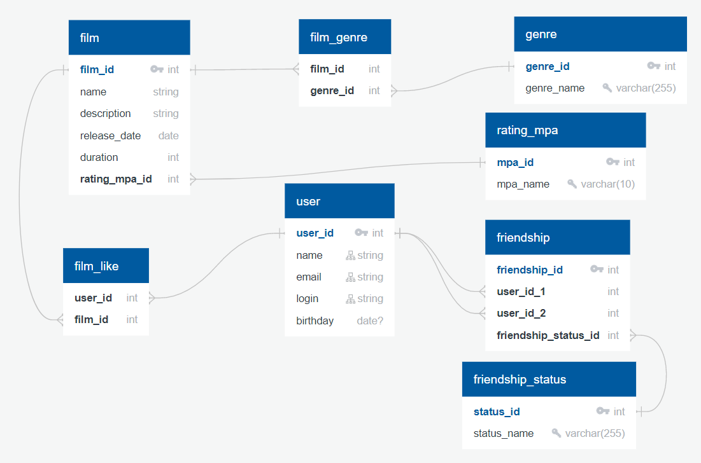

# java-filmorate
Filmorate project for Yandex.Practicum (java-developer course)

### ER Diagram:



### Запросы:
Список всех пользователей:

 ```
 SELECT user_id,
	name,
	email,
	login,
	birthday
 FROM user;
 ```

Список user_id друзей пользователя с user_id = 1:

 ```
 SELECT friend_is
 FROM friendship
 WHERE user_id = 1
 UNION
 SELECT user_id
 FROM friendship
 WHERE friend_is = 1;
 ```

Список всех фильмов:

 ```
 SELECT f.film_id,
	f.name,
	f.description,
	f.release_date,
	f.duration,
	mpa.mpa_name as rating_mpa
 FROM film f
 LEFT JOIN rating_mpa mpa;
 ```

Жанры фильма с film_id = 1:

 ```
 SELECT 
   fg.genre_name
 FROM film_genre fg
 LEFT JOIN genre g ON g.genre_id = fg.genre_id
 WHERE fg.film_id = 1;
 ```

Топ 10 наиболее популярных фильмов по лайкам:

 ```
 SELECT 
   f.film_id,
   count(fl.user_id) as rating
 FROM film f
 INNER JOIN film_like fl ON fl.film_id = f.film_id
 GROUP BY f.film_id
 ORDER BY count(fl.user_id) DESC
 LIMIT 10;
 ```

Список общих друзей для пользователей 1 и 2:

 ```
 SELECT a.friend_id 
 FROM (
	SELECT f.friend_id
	FROM friendship f
	WHERE f.user_id = 1
	UNION
	SELECT f.user_id
	FROM friendship f
	WHERE f.friend_id  = 1
 ) a
 INNER JOIN (
	SELECT f.friend_id
	FROM friendship f
	WHERE f.user_id = 2
	UNION
	SELECT f.user_id
	FROM friendship f
	WHERE f.friend_id  = 2 
 ) b on a.friend_id  = b.friend_id;
  ```
